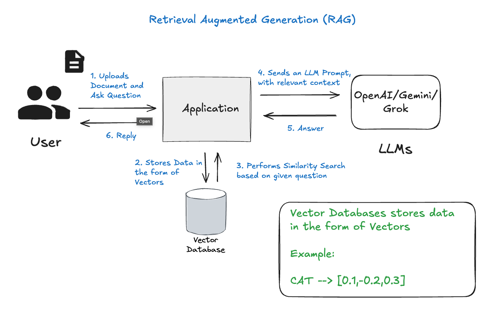
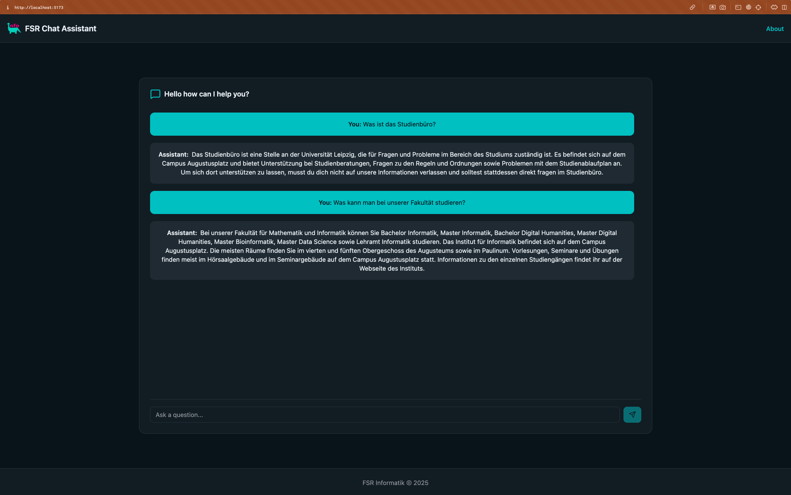

# FSR Rag Chat Assistant

The FSR Rag Chat Assistant is a Retrieval Augmented Generation (RAG) chatbot designed to support the student council of the computer science faculty at the University of Leipzig. It leverages **Spring AI** for backend intelligence and **React + shadcn/ui + Vite** for a modern, responsive frontend.

---

## Features

- Uses Spring AI for RAG-based question answering
- Integrates with Ollama for LLM capabilities
- Stores and retrieves vector embeddings using PGVector (PostgreSQL)
- Automatically processes and ingests documentation
- REST API for chat interaction
- Modern frontend built with React, shadcn/ui, and Vite

---

## Architecture

### RAG Architecture



### Backend (Spring AI)

- **Spring Boot** application with RAG pipeline
- **Ollama** for local LLM inference (e.g., Mistral model)
- **PGVector** for vector storage and retrieval
- **Document ingestion** pipeline for knowledge base

### Frontend (React + shadcn/ui + Vite)

- Responsive UI with shadcn/ui components
- Chat interface for user interaction
- Connects to backend REST API

---

## Chat Interface



---

## Prerequisites

### Backend

- Java 21
- Docker & Docker Compose
- Ollama installed locally
- Maven

### Frontend

- Node.js (>=18)
- npm

---

## Backend Setup

1. **Install Ollama**
   - See [Ollama's official website](https://ollama.ai)
   - Ensure Ollama runs at `http://localhost:11434`

2. **Pull the Mistral Model**
   ```bash
   ollama pull mistral
   ```

3. **Start PGVector Database**
   ```bash
   docker-compose up -d
   ```

4. **Build & Run Spring Boot Application**
   ```bash
   ./mvnw clean install
   ./mvnw spring-boot:run
   ```

---

## Frontend Setup

1. **Install dependencies**
   ```bash
   npm install
   ```

2. **Start development server**
   ```bash
   npm run dev
   ```

3. **Build for production**
   ```bash
   npm run build
   ```

4. **Preview production build**
   ```bash
   npm run preview
   ```

---

## Usage

- Ask questions via the web chat interface (React frontend)
- Or via API:
  ```bash
  curl -X POST http://localhost:8080/api/chat \
       -H "Content-Type: text/plain" \
       -d "What is Spring Boot?"
  ```

---

## Troubleshooting

- Ensure Ollama is running at `http://localhost:11434`
- Verify PostgreSQL container is running: `docker ps`
- Check backend logs for errors
- Ensure Mistral model is pulled in Ollama

---

## Dependencies

### Backend

- Spring Boot 3.4.3
- Spring AI (1.0.0-M6)
- PGVector
- Apache Tika

### Frontend

- React 19
- shadcn/ui
- Vite
- Tailwind CSS
- Lucide Icons

---

## Project Structure

- `spring-ai-rag-ollama/` — Backend (Spring AI, Ollama, PGVector)
- `fsr-rag-chat/` — Frontend (React + Vite)
